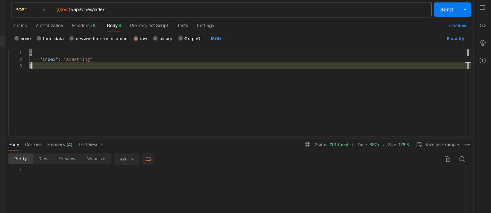

Project Components
ElasticsearchService
Package: com.vicarius.elasticsearch.service
Functionality: Interacts with Elasticsearch to create indices, create documents, and retrieve documents. Exceptions are handled to provide clear feedback on operation failures.

ElasticsearchController
Package: com.vicarius.elasticsearch.controller
Functionality: Exposes RESTful endpoints to interact with the Elasticsearch service. It includes endpoints for creating indices (/api/v1/es/index), creating documents (/api/v1/es/document), and retrieving documents (/api/v1/es/document/{id}).

LoggingAspect
Package: com.vicarius.elasticsearch.aspect
Functionality: Implements AOP for logging method execution, successful completions, and exceptions in ElasticsearchService. Ensures centralized and consistent logging across service methods.

DTOs
Package: com.vicarius.elasticsearch.model.dto
Models: DocumentRequestDto, DocumentResponseDto, IndexRequestDto
Functionality: Data Transfer Objects (DTOs) used for transferring data between processes. DTOs include validation annotations to ensure data integrity.

Validation
Field validations are implemented using annotations in DTOs to ensure the required fields are present and correctly formatted.

Exception Handling
Custom exceptions (DocumentNotFoundException, ElasticsearchOperationException) are used for clarity in error scenarios. Global exception handling is implemented using Spring’s @ControllerAdvice mechanism.

Usage
To create an index or a document, send a POST request to the respective endpoint with the required JSON body. To retrieve a document, send a GET request to /api/v1/es/document/{id} with the appropriate index name and document ID.
- Create Index:

Create Document With Index:

Get Document:

- Installation:
The easiest way to run the application is using a machine where maven and java 21 is installed. 
Apply following commands to run :
- mvn clean install & java -jar target/elasticsearch-1.0.0-SNAPSHOT.jar
- When the elasticsearch server
is started, the application will connect automatically to the elasticsearch server.
The ssl settings should be disabled from elasticsearch.yml file under the root elasticsearch directory.
-
# Enable security features
xpack.security.enabled: false

xpack.security.enrollment.enabled: false

The application uses the default configuration values (password, username & host) assigned defined by the elasticsearch server where you can find in application.properties.
If you are using a custom values, do not forget to override them before building the application.

Since the usage of docker is prevented, I have added 2 scripts(one for Linux adm, and one for macos).
It is important to keep in mind that, cloud providers charging additional amounts for the data downloaded from web, I did
not upload the service to any cloud provider because of that.
If you have local machine, and if the operating system is compatible, application should run
with the script.

Postman collection has been added as a json file.
